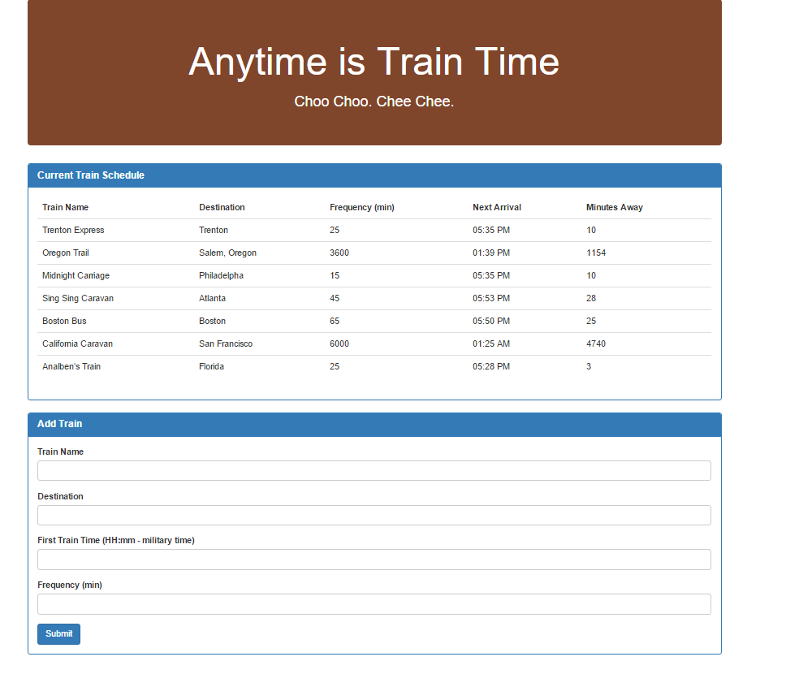

# No SQL Database? Then Firebase is the Answer

### Overview

For this application, I created a train schedule application that incorporates Firebase to host arrival and departure data. The app retrieves and manipulates this information with Moment.js. This website will provide up-to-date information about various trains, namely their arrival times and how many minutes remain until they arrive at their station.

### Project Guidelines

#### Setup

1. Make sure that your app suits this basic spec:
    * When adding trains, administrators should be able to submit the following:
        * Train Name
        * Destination
        * First Train Time -- in military time
        * Frequency -- in minutes
2. Code this app to calculate when the next train will arrive; this should be relative to the current time.
3. Users from many different machines must be able to view same train times.
4. Styling and theme are completely up to you. Get Creative!

#### Example Site

            

